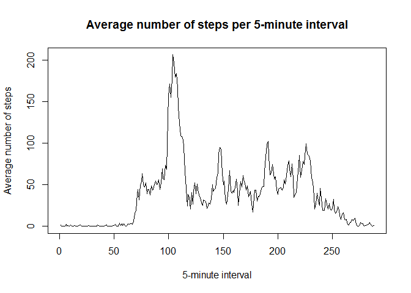
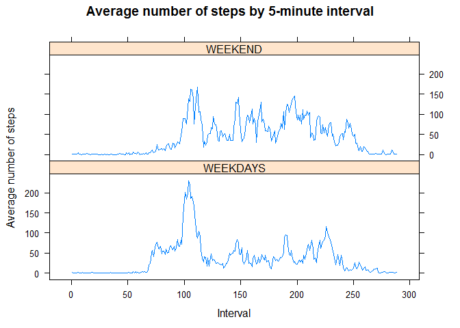

# Reproducible Research: Peer Assessment 1


##Loading and preprocessing the data

1. Load the data


```r
activity<-read.csv("activity.csv")
```

2. Process/transform the data (if necessary) into a format suitable for your analysis

Note: date is provided as factor.  Need to transform it to date format.


```r
activity$date<-as.Date(activity$date)
```


##What is mean total number of steps taken per day?

Ignoring the missing values in the dataset:

1. Calculate the total number of steps taken per day


```r
total_steps<-tapply(activity$steps,activity$date,sum, rm.na=TRUE)
```


2. Make a histogram of the total number of steps taken each day


```r
hist(total_steps, main = "Histogram of steps taken each day", xlab = "steps per day", axes = TRUE, breaks=10)
```

<!-- -->


3. Calculate and report the mean and median of the total number of steps taken per day


```r
mean_steps<-summary(tapply(activity$steps,activity$date,sum, rm.na=TRUE))[4]
median_steps<-summary(tapply(activity$steps,activity$date,sum, rm.na=TRUE))[3]
```

The mean number of steps taken by day is 10770 

The median number of steps taken by day is 10770 

## What is the average daily activity pattern?

1. Make a time series plot (i.e. type = "l") of the 5-minute interval (x-axis) and the average number of steps taken, averaged across all days (y-axis)


```r
x<-complete.cases(activity)
x<-activity[x,]
x2<-tapply(x$steps,x$interval,mean, rm.na=TRUE)
z<-names(x2)
x2<-as.data.frame(x2)
plot(x2, type = "l", xlab = "5-minute interval", main = "Average number of steps per 5-minute interval", ylab= "average number of steps")
```

<!-- -->

Note: There are 288 5-minute intervals each day

2. Which 5-minute interval, on average across all the days in the dataset, contains the maximum number of steps?


```r
y<-c(1:288)
xy<-cbind(y,z,x2)
xy<-as.data.frame(xy)
names(xy)<-c("interval_number", "interval", "mean_steps")
xy$interval_number<-as.factor(xy$interval_number)
xy$mean_steps<-as.numeric(xy$mean_steps)
max<-max(xy$mean_steps)
which_max<-which(xy$mean_steps==max)
int_max<-xy[which_max,1]
```

The interval with the maximun number of steps, is interval number 104 

##Imputing missing values

Note that there are a number of days/intervals where there are missing values (coded as NA). The presence of missing days may introduce bias into some calculations or summaries of the data.

1. Calculate and report the total number of missing values in the dataset (i.e. the total number of rows with NAs)


```r
x<-summary(activity$steps)[7]
```

There were 2304 NAs


2. Devise a strategy for filling in all of the missing values in the dataset. The strategy does not need to be sophisticated. For example, you could use the mean/median for that day, or the mean for that 5-minute interval, etc.

I chose to imput using the mean for that 5-minute interval.  that is, I will replace each NA by the average number of steps for that 5-minute interval across all days.


3. Create a new dataset that is equal to the original dataset but with the missing data filled in.


```r
activity$interval<-as.factor(activity$interval)
activity2<-merge(activity, xy, by="interval")

for (i in 1:nrow(activity2)) {
  if (is.na(activity2$steps[i])) activity2$steps[i] <-activity2$mean_steps[i]                           
}
```


4. Make a histogram of the total number of steps taken each day 


```r
total_steps2<-tapply(activity2$steps,activity2$date,sum, rm.na=TRUE)
hist(total_steps2, main = "Histogram of steps taken each day", xlab = "steps per day", axes = TRUE, breaks=10)
```

<!-- -->


5. Calculate and report the mean and median total number of steps taken per day. 


```r
mean_steps2<-summary(tapply(activity2$steps,activity$date,sum, rm.na=TRUE))[4]
median_steps2<-summary(tapply(activity2$steps,activity$date,sum, rm.na=TRUE))[3]
```

The mean number of steps taken by day is 10770 

The median number of steps taken by day is 9129 


6. Do these values differ from the estimates from the first part of the assignment? What is the impact of imputing missing data on the estimates of the total daily number of steps?

By imputing the average steps computed using the non-missing values for each interval, both means are the same: 10770 steps just like the 10770 steps   computed before.

However, the median steps are diffent: 9129 steps vs. 10770 steps   computed before.

##Are there differences in activity patterns between weekdays and weekends?


For this part the weekdays() function may be of some help here. Use the dataset with the filled-in missing values for this part.

1. Create a new factor variable in the dataset with two levels - "weekday" and "weekend" indicating whether a given date is a weekday or weekend day.


```r
library(lubridate)
```

```
## Warning: package 'lubridate' was built under R version 3.3.2
```

```
## 
## Attaching package: 'lubridate'
```

```
## The following object is masked from 'package:base':
## 
##     date
```

```r
activity2$date<-ymd(activity2$date)
activity2$day<-weekdays(activity2$date)
activity2$level<-c("weekday")
for (i in 1:nrow(activity2)){
  if(activity2$day[i]=="sábado" | activity2$day[i]=="domingo") activity2$level[i]<-c("weekend")
}
```


2. Make a panel plot containing a time series plot (i.e. type = "l") of the 5-minute interval (x-axis) and the average number of steps taken, averaged across all weekday days or weekend days (y-axis). See the README file in the GitHub repository to see an example of what this plot should look like using simulated data.


```r
weekday<-subset(activity2, level=="weekday")
weekend<-subset(activity2, level=="weekend")

## calculating for weekdays
xweekday<-tapply(weekday$steps,weekday$interval,mean, rm.na=TRUE)
xweekday<-as.data.frame(xweekday)
xweekday$days<-"WEEKDAYS"
xweekday$interval<- 1:nrow(xweekday)
names(xweekday) <-c("mean_steps", "Day", "Interval")

## calculating for weekends
xweekend<-tapply(weekend$steps,weekend$interval,mean, rm.na=TRUE)
names(xweekend) <-c("mean_steps")
xweekend<-as.data.frame(xweekend)
xweekend$days<-"WEEKEND"
xweekend$interval<- 1:nrow(xweekday)
names(xweekend) <-c("mean_steps", "Day", "Interval")

## combining in one dataset
day<-as.data.frame(rbind(xweekend, xweekday))

## building graph
library(lattice) 
```

```
## Warning: package 'lattice' was built under R version 3.3.2
```

```r
xyplot(mean_steps~Interval|day$Day, day, main="Average number of steps by interval", xlab="Interval", layout=c(1,2), type='l') 
```

<!-- -->


